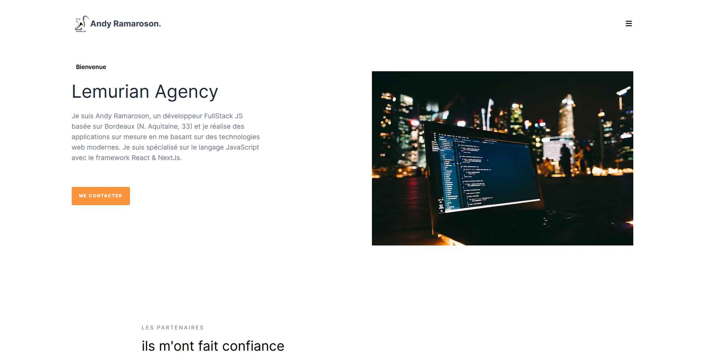

# Portfolio Andy Ramaroson 🇫🇷

<!-- [Pre-prod](https://portfolio-eta-three-93.vercel.app/)    -->
<!-- [Production](https://andyramaroson.com//) -->

------------------------------------------------

Projet Création de site web Développer avec NextJs | React  

**Présentation**

<kbd></kbd>

> PROBLEMATIQUE
Présenter de façon cohérente les différents projets au travers de ce site, présenter son activité et ses différents services.
créer un blog qui l'alimenterait avec des articles concernant son domaine expertise actuelle, ...
mais aussi crée une page service et ajouter un button calendly pour un rendez-vous ....

> BESOIN
Création du site avec une stack complète en JavaScript avec Nextjs, React et Tailwind css.

## Livrables

> React App
- code           : [Github](https://github.com/AndyRama/FullStack_Portfolio)
- pre-production: [vercel](https://portfolio-eta-three-93.vercel.app/)
<!-- - production     : [vercel](https://andyramaroson.com/) -->

## Compétences développées

- [x] Initialiser une application web avec un framework Nextjs
- [x] Créer des composants avec React 
- [x] Créer des différentes pages de l'application 
- [x] Utilisation de librairie externe 
- [x] création de test 
- [x] Module System de paiement
- [x] Module integration calendly
- [x] Déploiement

## Ressources

- maquette       : [Figma](https%3A%2F%2Fwww.figma.com%2Fdesign%2F9VjWT92jDvr5zQaWRCk7Og%2Flemurian-agency%3Fnode-id%3D0-1%26t%3DecE4rtV9gFFqf0Jc-1)
- Tableau        : [Trello](https://trello.com)

### Editeur recommandé

* [Visual Studio code](https://code.visualstudio.com/)

### Prérequis

* [Git](https://git-scm.com/) pour cloner les repos
* [NodeJS](https://nodejs.org/fr/) (version 18.18.1) pour exécuter les commandes
* [Npm](https://www.npmjs.com/) (version 6.14.17) pour lancer l'application (front-end)

### Dépendances

* [NextJs](https://nextjs.org/) (version 13.5.6)
* [React](https://legacy.reactjs.org/) (version 18)

* [Tailwind](https://www.npmjs.com/package/prop-types) (version 3.3.0)

* [React-icon](https://www.npmjs.com/package/react-icons) (version 5.0.1)
* [Contentlayer](https://www.npmjs.com/package/contentlayer) (version 0.3.4)
* [Framer-motion](https://www.npmjs.com/package/framer-motion) (version 11.0.8)
* [Swipper](https://www.npmjs.com/package/swiper/v/11.0.3) (version 11.0.3)
* [date-fns](https://www.npmjs.com/package/date-fns) (version 3.3.1)

* [Eslint](https://www.npmjs.com/package/eslint) (version 8.57.0)
* [Prettier](https://www.npmjs.com/package/prettier) (version 3.2.5)

* [Jest](https://www.npmjs.com/package/jest/v/29.6.4) (version 29.6.4)

### Etape: Lancement du project

- Cloner le repo du projet : `gh repo clone AndyRama/FullStack_Portfolio`
- Aller dans ce dossier : `cd FullStack_Portfolio `
- Installer ses dépendances : `npm install`
- Le lancer sur le port 3000 : `npm run dev`
- Ouvrez [http://localhost:3000](http://localhost:3000) pour l'afficher dans votre navigateur.

## Fonctionnalité

- [x] Construire et déploiement de l'application

---------------------------

# Andy Ramaroson Portfolio 🇬🇧

[Pre-prod](https://portfolio-eta-three-93.vercel.app/)  
<!-- [Production](https://andyramaroson.com//) -->

------------------------------------------------

Website Creation Project Develop with NextJs | React

**Presentation**

<kbd></kbd>

> PROBLEMATIC
Coherently present the different projects through this site, present its activity and its different services.
create a blog that would feed it with articles concerning its current area of ​​expertise, ...
but also create a service page and add a calendar button for an appointment....

> NEED
Creation of the site with a complete stack in JavaScript with Nextjs, React and Tailwind css.

## Deliverables

> ReactApp
- code: [Github](https://github.com/AndyRama/FullStack_Portfolio)
<!-- - pre-production: [vercel](https://portfolio-eta-three-93.vercel.app/) -->
<!-- - production: [vercel](https://andyramaroson.com/) -->

## Skills developed

- [x] Initialize a web application with a Nextjs framework
- [x] Create components with React
- [x] Create different pages of the application
- [x] Use of external library
- [x] test creation
- [x] Payment System Module
- [x] Module integration calendly
- [x] Deployment

## Resources

- model: [Figma](https%3A%2F%2Fwww.figma.com%2Fdesign%2F9VjWT92jDvr5zQaWRCk7Og%2Flemurian-agency%3Fnode-id%3D0-1%26t%3DecE4rtV9gFFqf0Jc-1)
- Board: [Trello](https://trello.com)

### Recommended editor

* [Visual Studio code](https://code.visualstudio.com/)

### Prerequisites

* [Git](https://git-scm.com/) to clone repos
* [NodeJS](https://nodejs.org/fr/) (version 18.18.1) to execute commands
* [Npm](https://www.npmjs.com/) (version 6.14.17) to launch the application (front-end)

### Dependencies

* [NextJs](https://nextjs.org/) (version 13.5.6)
* [React](https://legacy.reactjs.org/) (version 18)

* [Tailwind](https://www.npmjs.com/package/prop-types) (version 3.3.0)

* [React-icon](https://www.npmjs.com/package/react-icons) (version 5.0.1)
* [Contentlayer](https://www.npmjs.com/package/contentlayer) (version 0.3.4)
* [Framer-motion](https://www.npmjs.com/package/framer-motion) (version 11.0.8)
* [Swipper](https://www.npmjs.com/package/swiper/v/11.0.3) (version 11.0.3)
* [date-fns](https://www.npmjs.com/package/date-fns) (version 3.3.1)

* [Eslint](https://www.npmjs.com/package/eslint) (version 8.57.0)
* [Prettier](https://www.npmjs.com/package/prettier) (version 3.2.5)

* [Jest](https://www.npmjs.com/package/jest/v/29.6.4) (version 29.6.4)

### Step: Launch of the project

- Clone the project repo: `gh repo clone AndyRama/FullStack_Portfolio`
- Go to this folder: `cd FullStack_Portfolio`
- Install its dependencies: `npm install`
- Run it on port 3000: `npm run dev`
- Open [http://localhost:3000](http://localhost:3000) to view it in your browser.

## Functionality

- [x] Build and deploy the application

---------------------------